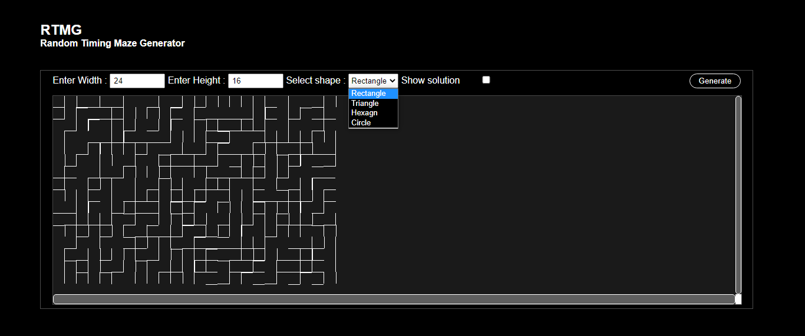
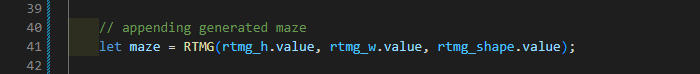

<h1 style="font-size:30px;">Random Timing Algorithms "RTA"</h1>
<h3>RTA is a js library containing algorithms that serves various purposes. <a href="js/RTA.js" download>Download.</a></h3>

 

<!-- RTE & RTD -->

<h1>RTE & RTD</h1>
<h3>Random Timing Encryption & Decryption <a href="https://firaselmoussa.github.io/Random_Timing_Algorithms_RTA/">preview.</a></h3>

 

  

 <h2>How to use :</h2>

<h3>To Encrypt</h3>
 
 
 <h3>To Decrypt</h3>
 

   

<!-- RTMG -->

<h1>RTMG</h1>
<h3>Random Timing Maze Generator<a href="https://firaselmoussa.github.io/Random_Timing_Algorithms_RTA/">preview.</a></h3>

 

  

 <h2>How to use :</h2>

<h3>call RTMG()</h3>
 
