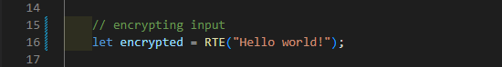

<h1 style="font-size:30px;">Random Timing Algorithms "RTA"</h1>
<h3>RTA is a js library containing algorithms that serves various purposes.</h3>

 

<!-- RTE & RTD -->

<h1>RTE & RTD</h1>
<h3>Random Timing Encryption & Decryption</h3>

 

  

 <h2>How to use :</h2>

<h3>To Encrypt</h3>
 

  
 
 <h3>To Decrypt</h3>
  
