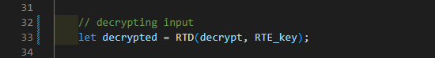

<h1 style="font-size:30px;">Random Timing Algorithms "RTA"</h1>
<h3>RTA is a js library containing algorithms that serves various purposes. <a href="js/RTA.js" download>Download.</a></h3>

 

<!-- RTE & RTD -->

<h1>RTE & RTD</h1>
<h3>Random Timing Encryption & Decryption <a href="https://firaselmoussa.github.io/Random_Timing_Algorithms_RTA/">preview.</a></h3>

 

  

 <h2>How to use :</h2>

<h3>To Encrypt</h3>
 
 
 <h3>To Decrypt</h3>
 

   

<!-- RTMG -->

<h1>RTMG</h1>
<h3>Random Timing Maze Generator <a href="https://firaselmoussa.github.io/Random_Timing_Algorithms_RTA/">preview.</a></h3>

 

  

 <h3>In a 5 * 5 maze a sample path could be determined by the systematic diagram below :</h3>

 

<table style="width:20%">
  <tr>
    <td>0</td><td>1</td><td>2</td><td>3</td><td>4</td>
  </tr>
  <tr>
    <td>5</td><td>6</td><td>7</td><td>8</td><td>9</td>
  </tr>
    <tr>
    <td>10</td><td>11</td><td>12</td><td>13</td><td>14</td>
  </tr>
    <tr>
    <td>15</td><td>16</td><td>17</td><td>18</td><td>19</td>
  </tr>
  <tr>
    <td>20</td><td>21</td><td>22</td><td>23</td><td>24</td>
  </tr>
</table>

 

  

 <h2>How to use :</h2>

<h3>call RTMG()</h3>
 
