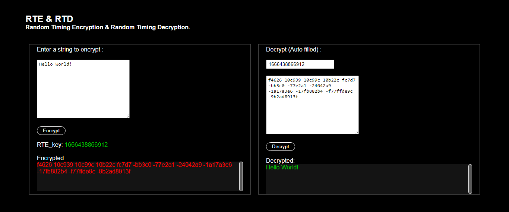

<h1>Random Timing Algorithms "RTA"</h1>
<h3>RTA is a js library containing algorithms that serves various purposes.</h3>

 

<!-- RTE & RTD -->

<h2>RTE & RTD</h2>
<h4>Random Timing Encryption & Decryption</h4>

 
